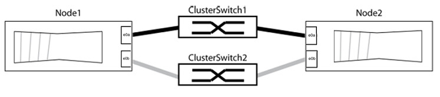

= Remplacez les commutateurs de cluster Cisco Nexus 3132Q-V par des connexions sans commutateur
:allow-uri-read: 
:icons: font
:imagesdir: ../media/

[role="lead"]
Dans ONTAP 9.3 et versions ultérieures, vous pouvez migrer d'un cluster avec un réseau de cluster commuté vers un cluster où deux nœuds sont directement connectés.

[NOTE]
====
NetApp vous recommande de mettre à jour votre version ONTAP avant de procéder à l'opération de basculement vers un cluster sans commutateur pour les commutateurs Cisco Nexus 3132Q-V.

Pour plus d'informations, consultez les documents suivants :

* link:https://kb.netapp.com/Support_Bulletins/Customer_Bulletins/SU540["SU540 : Les erreurs de la carte réseau Chelsio T6 provoquent l'arrêt du système lors de la mise à niveau des commutateurs réseau 40G vers 100G"^]
* link:https://kb.netapp.com/on-prem/ontap/OHW/OHW-KBs/Node_panic_after_migration_from_switched_to_switchless_cluster["Panique du nœud après la migration d'un cluster commuté vers un cluster sans commutateur"^]

====
Vous pouvez migrer d'un cluster avec un réseau de cluster commuté vers un cluster auquel deux nœuds sont directement connectés pour ONTAP 9.3 et les versions ultérieures.

== Examen des conditions requises

.Directives
Consultez les directives suivantes :

* La migration vers une configuration de cluster à 2 nœuds sans commutateur assure une continuité de l'activité. La plupart des systèmes disposent de deux ports d'interconnexion de cluster dédiés sur chaque nœud, mais cette procédure peut également être utilisée pour les systèmes avec un plus grand nombre de ports d'interconnexion de cluster dédiés sur chaque nœud, tels que quatre, six ou huit.
* Vous ne pouvez pas utiliser la fonctionnalité d'interconnexion de cluster sans commutateur avec plus de deux nœuds.
* Si vous disposez déjà d'un cluster à deux nœuds avec des commutateurs d'interconnexion de cluster et qu'il exécute ONTAP 9.3 ou une version ultérieure, vous pouvez remplacer les commutateurs par des connexions directes et retour entre les nœuds.

.Avant de commencer
Assurez-vous de disposer des éléments suivants :

* Cluster sain qui se compose de deux nœuds connectés par des commutateurs de cluster. Les nœuds doivent exécuter la même version de ONTAP.
* Chaque nœud inclut le nombre requis de ports de cluster dédiés qui offrent des connexions d'interconnexion de cluster redondantes pour prendre en charge votre configuration système. Par exemple, un système dispose de deux ports redondants avec deux ports dédiés d'interconnexion de cluster sur chaque nœud.

== Migrer les commutateurs

.Description de la tâche
La procédure suivante supprime les commutateurs du cluster dans un cluster à deux nœuds et remplace chaque connexion au commutateur par une connexion directe au nœud partenaire.

image::../media/tnsc_clusterswitches_and_direct_connections.PNG[Les commutateurs du cluster ont été remplacés par des connexions directes]

.À propos des exemples
Les exemples de la procédure suivante illustrent les nœuds qui utilisent « e0a » et « e0b » comme ports de cluster. Il est possible que les nœuds utilisent différents ports de cluster, car ils varient selon le système.

=== Étape 1 : préparer la migration

. Modifiez le niveau de privilège en avancé, en saisissant `y` lorsque vous êtes invité à continuer :
+
`set -privilege advanced`

+
L'invite avancée `*>` s'affiche.

. ONTAP 9.3 et les versions ultérieures prennent en charge la détection automatique des clusters sans commutateur, qui est activée par défaut.
+
Vous pouvez vérifier que la détection des clusters sans commutateur est activée en exécutant la commande Advanced Privilege :

+
`network options detect-switchless-cluster show`

+
.Montrer l'exemple
[%collapsible]
====
L'exemple de sortie suivant indique si l'option est activée.

[listing]
----
cluster::*> network options detect-switchless-cluster show
   (network options detect-switchless-cluster show)
Enable Switchless Cluster Detection: true
----
====
+
Si l'option « Activer la détection Switchless Cluster » est de `false`, Contactez le support NetApp.

. Si AutoSupport est activé sur ce cluster, supprimez la création automatique de dossiers en invoquant un message AutoSupport :
+
`system node autosupport invoke -node * -type all -message MAINT=<number_of_hours>h`

+
où `h` est la durée de la fenêtre de maintenance en heures. Ce message informe le support technique de cette tâche de maintenance de manière à ce qu'il puisse supprimer la création automatique de dossier pendant la fenêtre de maintenance.

+
Dans l'exemple suivant, la commande supprime la création automatique de dossiers pendant deux heures :

+
.Montrer l'exemple
[%collapsible]
====
[listing]
----
cluster::*> system node autosupport invoke -node * -type all -message MAINT=2h
----
====

=== Étape 2 : configurer les ports et le câblage

. Organisez les ports de cluster de chaque commutateur en groupes de sorte que les ports de cluster du groupe1 passent au switch de cluster 1 et que les ports de cluster du groupe2 se rendent au switch de cluster 2. Ces groupes sont requis plus tard dans la procédure.
. Identifier les ports du cluster et vérifier l'état et l'état de la liaison :
+
`network port show -ipspace Cluster`

+
Dans l'exemple suivant pour les nœuds avec des ports de cluster « e0a » et « e0b », un groupe est identifié comme « node1:e0a » et « node2:e0a » et l'autre groupe comme « node1:e0b » et « node2:e0b ». Vos nœuds peuvent utiliser différents ports de cluster car ils varient selon le système.

+

+
Vérifier que les ports ont une valeur de `up` Pour la colonne “liaison” et une valeur de `healthy` Pour la colonne État de santé.

+
.Montrer l'exemple
[%collapsible]
====
[listing]
----
cluster::> network port show -ipspace Cluster
Node: node1
                                                                 Ignore
                                             Speed(Mbps) Health  Health
Port  IPspace   Broadcast Domain Link  MTU   Admin/Oper	 Status  Status
----- --------- ---------------- ----- ----- ----------- ------- -------
e0a   Cluster   Cluster          up    9000  auto/10000  healthy false
e0b   Cluster   Cluster          up    9000  auto/10000  healthy false

Node: node2
                                                                 Ignore
                                             Speed(Mbps) Health  Health
Port  IPspace   Broadcast Domain Link  MTU   Admin/Oper	 Status  Status
----- --------- ---------------- ----- ----- ----------- ------- -------
e0a   Cluster   Cluster          up    9000  auto/10000  healthy false
e0b   Cluster   Cluster          up    9000  auto/10000  healthy false
4 entries were displayed.
----
====
. Vérifier que toutes les LIFs du cluster se trouvent sur leurs ports de type home.
+
Vérifiez que la colonne « est-home » est de `true` Pour chaque LIF de cluster :

+
`network interface show -vserver Cluster -fields is-home`

+
.Montrer l'exemple
[%collapsible]
====
[listing]
----
cluster::*> net int show -vserver Cluster -fields is-home
(network interface show)
vserver  lif          is-home
-------- ------------ --------
Cluster  node1_clus1  true
Cluster  node1_clus2  true
Cluster  node2_clus1  true
Cluster  node2_clus2  true
4 entries were displayed.
----
====
+
Si des LIF de cluster ne se trouvent pas sur leurs ports de départ, rerestaurez ces LIFs à leurs ports de base :

+
`network interface revert -vserver Cluster -lif *`

. Désactiver l'auto-revert pour les LIFs de cluster :
+
`network interface modify -vserver Cluster -lif * -auto-revert false`

. Vérifiez que tous les ports répertoriés à l'étape précédente sont connectés à un commutateur réseau :
+
`network device-discovery show -port _cluster_port_`

+
La colonne “périphérique découvert” doit être le nom du commutateur de cluster auquel le port est connecté.

+
.Montrer l'exemple
[%collapsible]
====
L'exemple suivant montre que les ports de cluster « e0a » et « e0b » sont correctement connectés aux commutateurs de cluster « cs1 » et « cs2 ».

[listing]
----
cluster::> network device-discovery show -port e0a|e0b
  (network device-discovery show)
Node/     Local  Discovered
Protocol  Port   Device (LLDP: ChassisID)  Interface  Platform
--------- ------ ------------------------- ---------- ----------
node1/cdp
          e0a    cs1                       0/11       BES-53248
          e0b    cs2                       0/12       BES-53248
node2/cdp
          e0a    cs1                       0/9        BES-53248
          e0b    cs2                       0/9        BES-53248
4 entries were displayed.
----
====
. Vérifiez la connectivité des interfaces de cluster distantes :

[role="tabbed-block"]
====
.ONTAP 9.9.1 et versions ultérieures
--
Vous pouvez utiliser le `network interface check cluster-connectivity` pour lancer un contrôle d'accessibilité pour la connectivité du cluster, puis afficher les détails :

`network interface check cluster-connectivity start` et `network interface check cluster-connectivity show`

[listing, subs="+quotes"]
----
cluster1::*> *network interface check cluster-connectivity start*
----
*REMARQUE :* attendez un certain nombre de secondes avant d'exécuter `show` la commande pour afficher les détails.

[listing, subs="+quotes"]
----
cluster1::*> *network interface check cluster-connectivity show*
                                  Source           Destination      Packet
Node   Date                       LIF              LIF              Loss
------ -------------------------- ---------------- ---------------- -----------
node1
       3/5/2022 19:21:18 -06:00   node1_clus2      node2-clus1      none
       3/5/2022 19:21:20 -06:00   node1_clus2      node2_clus2      none
node2
       3/5/2022 19:21:18 -06:00   node2_clus2      node1_clus1      none
       3/5/2022 19:21:20 -06:00   node2_clus2      node1_clus2      none
----
--
.Toutes les versions de ONTAP
--
Pour toutes les versions de ONTAP, vous pouvez également utiliser `cluster ping-cluster -node <name>` pour vérifier la connectivité :

`cluster ping-cluster -node <name>`

[listing, subs="+quotes"]
----
cluster1::*> *cluster ping-cluster -node local*
Host is node2
Getting addresses from network interface table...
Cluster node1_clus1 169.254.209.69 node1 e0a
Cluster node1_clus2 169.254.49.125 node1 e0b
Cluster node2_clus1 169.254.47.194 node2 e0a
Cluster node2_clus2 169.254.19.183 node2 e0b
Local = 169.254.47.194 169.254.19.183
Remote = 169.254.209.69 169.254.49.125
Cluster Vserver Id = 4294967293
Ping status:

Basic connectivity succeeds on 4 path(s)
Basic connectivity fails on 0 path(s)

Detected 9000 byte MTU on 4 path(s):
Local 169.254.47.194 to Remote 169.254.209.69
Local 169.254.47.194 to Remote 169.254.49.125
Local 169.254.19.183 to Remote 169.254.209.69
Local 169.254.19.183 to Remote 169.254.49.125
Larger than PMTU communication succeeds on 4 path(s)
RPC status:
2 paths up, 0 paths down (tcp check)
2 paths up, 0 paths down (udp check)
----
--
====
. [[step7]] Vérifiez que le cluster fonctionne correctement :
+
`cluster ring show`

+
Toutes les unités doivent être maîtres ou secondaires.

. Configurez la configuration sans commutateur pour les ports du groupe 1.
+

IMPORTANT: Pour éviter d'éventuels problèmes de mise en réseau, vous devez déconnecter les ports du groupe1 et les reconnecter le plus rapidement possible, par exemple *en moins de 20 secondes*.

+
.. Débrancher tous les câbles des orifices du groupe1 en même temps.
+
Dans l'exemple suivant, les câbles sont déconnectés du port « e0a » sur chaque nœud, et le trafic du cluster continue via le commutateur et le port « e0b » sur chaque nœud :

+
image::../media/tnsc_clusterswitch1_disconnected.PNG[ClusterSwitch1 déconnecté]

.. Reliez les orifices du groupe1 vers l'arrière.
+
Dans l'exemple suivant, « e0a » sur le nœud 1 est connecté à « e0a » sur le nœud 2 :

+
image::../media/tnsc_ports_e0a_direct_connection.PNG[Connexion directe entre les ports « e0a »]

. L'option de réseau en cluster sans commutateur passe de `false` à `true`. Cette opération peut prendre jusqu'à 45 secondes. Vérifiez que l'option sans commutateur est définie sur `true`:
+
`network options switchless-cluster show`

+
L'exemple suivant montre que le cluster sans commutateur est activé :

+
[listing]
----
cluster::*> network options switchless-cluster show
Enable Switchless Cluster: true
----
. Vérifiez la connectivité des interfaces de cluster distantes :

[role="tabbed-block"]
====
.ONTAP 9.9.1 et versions ultérieures
--
Vous pouvez utiliser le `network interface check cluster-connectivity` pour lancer un contrôle d'accessibilité pour la connectivité du cluster, puis afficher les détails :

`network interface check cluster-connectivity start` et `network interface check cluster-connectivity show`

[listing, subs="+quotes"]
----
cluster1::*> *network interface check cluster-connectivity start*
----
*REMARQUE :* attendez un certain nombre de secondes avant d'exécuter `show` la commande pour afficher les détails.

[listing, subs="+quotes"]
----
cluster1::*> *network interface check cluster-connectivity show*
                                  Source           Destination      Packet
Node   Date                       LIF              LIF              Loss
------ -------------------------- ---------------- ---------------- -----------
node1
       3/5/2022 19:21:18 -06:00   node1_clus2      node2-clus1      none
       3/5/2022 19:21:20 -06:00   node1_clus2      node2_clus2      none
node2
       3/5/2022 19:21:18 -06:00   node2_clus2      node1_clus1      none
       3/5/2022 19:21:20 -06:00   node2_clus2      node1_clus2      none
----
--
.Toutes les versions de ONTAP
--
Pour toutes les versions de ONTAP, vous pouvez également utiliser `cluster ping-cluster -node <name>` pour vérifier la connectivité :

`cluster ping-cluster -node <name>`

[listing, subs="+quotes"]
----
cluster1::*> *cluster ping-cluster -node local*
Host is node2
Getting addresses from network interface table...
Cluster node1_clus1 169.254.209.69 node1 e0a
Cluster node1_clus2 169.254.49.125 node1 e0b
Cluster node2_clus1 169.254.47.194 node2 e0a
Cluster node2_clus2 169.254.19.183 node2 e0b
Local = 169.254.47.194 169.254.19.183
Remote = 169.254.209.69 169.254.49.125
Cluster Vserver Id = 4294967293
Ping status:

Basic connectivity succeeds on 4 path(s)
Basic connectivity fails on 0 path(s)

Detected 9000 byte MTU on 4 path(s):
Local 169.254.47.194 to Remote 169.254.209.69
Local 169.254.47.194 to Remote 169.254.49.125
Local 169.254.19.183 to Remote 169.254.209.69
Local 169.254.19.183 to Remote 169.254.49.125
Larger than PMTU communication succeeds on 4 path(s)
RPC status:
2 paths up, 0 paths down (tcp check)
2 paths up, 0 paths down (udp check)
----
--
====

IMPORTANT: Avant de passer à l'étape suivante, vous devez attendre au moins deux minutes pour confirmer une connexion de retour à l'arrière sur le groupe 1.

. [[step11]] configurez la configuration sans commutateur pour les ports du groupe 2.
+

IMPORTANT: Pour éviter des problèmes de mise en réseau potentiels, vous devez déconnecter les ports du groupe 2 et les reconnecter le plus rapidement possible, par exemple *en moins de 20 secondes*.

+
.. Déconnectez tous les câbles des ports du groupe 2 en même temps.
+
Dans l'exemple suivant, les câbles sont déconnectés du port « e0b » sur chaque nœud, et le trafic des clusters continue via la connexion directe entre les ports « e0a » :

+
image::../media/tnsc_clusterswitch2_disconnected.PNG[ClusterSwitch2 déconnecté]

.. Reliez les ports du groupe2 dos à dos.
+
Dans l'exemple suivant, « e0a » sur le nœud 1 est connecté à « e0a » sur le nœud 2 et « e0b » sur le nœud 1 est connecté au port « e0b » sur le nœud 2 :

+
image::../media/tnsc_node1_and_node2_direct_connection.PNG[Connexion directe entre les ports du node1 et du node2]

=== Étape 3 : vérifier la configuration

. Vérifiez que les ports des deux nœuds sont correctement connectés :
+
`network device-discovery show -port _cluster_port_`

+
.Montrer l'exemple
[%collapsible]
====
L'exemple suivant montre que les ports de cluster « e0a » et « e0b » sont correctement connectés au port correspondant du partenaire de cluster :

[listing]
----
cluster::> net device-discovery show -port e0a|e0b
  (network device-discovery show)
Node/      Local  Discovered
Protocol   Port   Device (LLDP: ChassisID)  Interface  Platform
---------- ------ ------------------------- ---------- ----------
node1/cdp
           e0a    node2                     e0a        AFF-A300
           e0b    node2                     e0b        AFF-A300
node1/lldp
           e0a    node2 (00:a0:98:da:16:44) e0a        -
           e0b    node2 (00:a0:98:da:16:44) e0b        -
node2/cdp
           e0a    node1                     e0a        AFF-A300
           e0b    node1                     e0b        AFF-A300
node2/lldp
           e0a    node1 (00:a0:98:da:87:49) e0a        -
           e0b    node1 (00:a0:98:da:87:49) e0b        -
8 entries were displayed.
----
====
. Réactiver l'auto-revert pour les LIFs du cluster :
+
`network interface modify -vserver Cluster -lif * -auto-revert true`

. Vérifier que toutes les LIFs sont bien. Cette opération peut prendre quelques secondes.
+
`network interface show -vserver Cluster -lif _lif_name_`

+
.Montrer l'exemple
[%collapsible]
====
Les LIFs ont été rétablies si la colonne « est à l'origine » est `true`, comme indiqué pour `node1_clus2` et `node2_clus2` dans l'exemple suivant :

[listing]
----
cluster::> network interface show -vserver Cluster -fields curr-port,is-home
vserver  lif           curr-port is-home
-------- ------------- --------- -------
Cluster  node1_clus1   e0a       true
Cluster  node1_clus2   e0b       true
Cluster  node2_clus1   e0a       true
Cluster  node2_clus2   e0b       true
4 entries were displayed.
----
====
+
Si une LIF DE cluster n'est pas retournée sur son port de rattachement, la restaurer manuellement depuis le nœud local :

+
`network interface revert -vserver Cluster -lif _lif_name_`

. Vérifiez l'état du cluster des nœuds depuis la console système de l'un ou l'autre nœuds :
+
`cluster show`

+
.Montrer l'exemple
[%collapsible]
====
L'exemple suivant montre epsilon sur les deux nœuds à être `false`:

[listing]
----
Node  Health  Eligibility Epsilon
----- ------- ----------- --------
node1 true    true        false
node2 true    true        false
2 entries were displayed.
----
====
. Vérifiez la connectivité des interfaces de cluster distantes :

[role="tabbed-block"]
====
.ONTAP 9.9.1 et versions ultérieures
--
Vous pouvez utiliser le `network interface check cluster-connectivity` pour lancer un contrôle d'accessibilité pour la connectivité du cluster, puis afficher les détails :

`network interface check cluster-connectivity start` et `network interface check cluster-connectivity show`

[listing, subs="+quotes"]
----
cluster1::*> *network interface check cluster-connectivity start*
----
*REMARQUE :* attendez un certain nombre de secondes avant d'exécuter `show` la commande pour afficher les détails.

[listing, subs="+quotes"]
----
cluster1::*> *network interface check cluster-connectivity show*
                                  Source           Destination      Packet
Node   Date                       LIF              LIF              Loss
------ -------------------------- ---------------- ---------------- -----------
node1
       3/5/2022 19:21:18 -06:00   node1_clus2      node2-clus1      none
       3/5/2022 19:21:20 -06:00   node1_clus2      node2_clus2      none
node2
       3/5/2022 19:21:18 -06:00   node2_clus2      node1_clus1      none
       3/5/2022 19:21:20 -06:00   node2_clus2      node1_clus2      none
----
--
.Toutes les versions de ONTAP
--
Pour toutes les versions de ONTAP, vous pouvez également utiliser `cluster ping-cluster -node <name>` pour vérifier la connectivité :

`cluster ping-cluster -node <name>`

[listing, subs="+quotes"]
----
cluster1::*> *cluster ping-cluster -node local*
Host is node2
Getting addresses from network interface table...
Cluster node1_clus1 169.254.209.69 node1 e0a
Cluster node1_clus2 169.254.49.125 node1 e0b
Cluster node2_clus1 169.254.47.194 node2 e0a
Cluster node2_clus2 169.254.19.183 node2 e0b
Local = 169.254.47.194 169.254.19.183
Remote = 169.254.209.69 169.254.49.125
Cluster Vserver Id = 4294967293
Ping status:

Basic connectivity succeeds on 4 path(s)
Basic connectivity fails on 0 path(s)

Detected 9000 byte MTU on 4 path(s):
Local 169.254.47.194 to Remote 169.254.209.69
Local 169.254.47.194 to Remote 169.254.49.125
Local 169.254.19.183 to Remote 169.254.209.69
Local 169.254.19.183 to Remote 169.254.49.125
Larger than PMTU communication succeeds on 4 path(s)
RPC status:
2 paths up, 0 paths down (tcp check)
2 paths up, 0 paths down (udp check)
----
--
====
. [[step6]] si vous avez supprimé la création automatique de cas, réactivez-la en appelant un message AutoSupport :
+
`system node autosupport invoke -node * -type all -message MAINT=END`

+
Pour plus d'informations, voir link:https://kb.netapp.com/Advice_and_Troubleshooting/Data_Storage_Software/ONTAP_OS/How_to_suppress_automatic_case_creation_during_scheduled_maintenance_windows_-_ONTAP_9["Article 1010449 de la base de connaissances NetApp : comment supprimer la création automatique de dossiers pendant les fenêtres de maintenance planifiées"^].

. Rétablissez le niveau de privilège sur admin :
+
`set -privilege admin`

