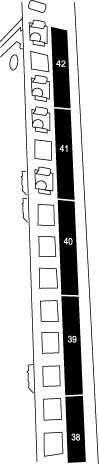

= Installez un commutateur de stockage Cisco Nexus 3232C dans une armoire NetApp
:allow-uri-read: 
:icons: font
:imagesdir: ../media/

[role="lead"]
Selon votre configuration, vous devrez peut-être installer le commutateur de stockage Cisco Nexus 3232C et le panneau de passage dans une armoire NetApp avec les supports standard fournis avec le commutateur.

.Avant de commencer
Vérifiez que vous disposez des éléments suivants : * Les exigences de préparation initiale, le contenu du kit et les consignes de sécurité dans le link:http://www.cisco.com/c/en/us/td/docs/switches/datacenter/nexus3000/hw/installation/guide/b_n3000_hardware_install_guide.html["Guide d'installation matérielle de la gamme Cisco Nexus 3000"^]. * Pour chaque commutateur, les huit vis 10-32 ou 12-24 et les écrous à clip pour fixer les supports et les rails de guidage aux montants avant et arrière de l’armoire. * Le kit de rails standard Cisco pour installer le commutateur dans une NetApp armoire.

[NOTE]
====
Les câbles de connexion ne sont pas inclus dans le kit de passage et doivent être fournis avec vos commutateurs.  S'ils n'ont pas été livrés avec les commutateurs, vous pouvez les commander auprès de NetApp (référence X1558A-R6).

====
.Étapes
. Installez le panneau de fermeture traversant dans l'armoire NetApp .
+
Le kit de panneau traversant est disponible chez NetApp (référence X8784-R6).

+
Le kit de panneau de transfert NetApp contient le matériel suivant :

+
** Un panneau d'obturation traversant
** Quatre vis 10-32 x 0,75
** Quatre écrous à clip 10-32
+
... Déterminez l'emplacement vertical des interrupteurs et du panneau d'obturation dans l'armoire.
+
Dans cette procédure, le panneau d'obturation sera installé dans U40.

... Installez deux écrous à clip de chaque côté dans les trous carrés appropriés pour les rails avant de l'armoire.
... Centrez le panneau verticalement pour éviter toute intrusion dans l'espace rack adjacent, puis serrez les vis.
... Insérez les connecteurs femelles des deux cordons de raccordement de 48 pouces par l'arrière du panneau et à travers l'ensemble de brosses.
+
image::../media/cisco_9148_jumper_cords.gif[]

(1) Connecteur femelle du cordon de raccordement.

. Installez les supports de montage en rack sur le châssis du commutateur de stockage Nexus 3232C.
+
.. Placez un support de montage en rack avant sur un côté du châssis du commutateur de sorte que l'oreille de montage soit alignée avec la plaque frontale du châssis (côté bloc d'alimentation ou ventilateur), puis utilisez quatre vis M4 pour fixer le support au châssis.
+
image::../media/3132q_front_bracket.gif[support avant]

.. Répétez l’étape 2a avec l’autre support de montage en rack avant de l’autre côté du commutateur.
.. Installez le support de montage en rack arrière sur le châssis du commutateur.
.. Répétez l’étape 2c avec l’autre support de montage en rack arrière de l’autre côté du commutateur.

. Installez les écrous à clip dans les emplacements des trous carrés pour les quatre poteaux IEA.
+

+
Les deux commutateurs 3232C seront toujours montés dans les 2U supérieurs de l'armoire RU41 et 42.

. Installez les rails de guidage dans l'armoire.
+
.. Positionnez le premier rail coulissant au niveau de la marque RU42 à l'arrière du montant arrière gauche, insérez des vis avec le type de filetage correspondant, puis serrez les vis avec vos doigts.
+
image::../media/3132q_v_slider_rails.gif[]

+
_(1) En faisant glisser délicatement le rail coulissant, alignez-le avec les trous de vis du rack._ + _(2) Serrez les vis des rails coulissants sur les montants du meuble._

.. Répétez l'étape 4a pour le montant arrière droit.
.. Répétez les étapes 4a et 4b aux emplacements RU41 sur l'armoire.

. Installez l'interrupteur dans l'armoire.
+
[NOTE]
====
Cette étape nécessite deux personnes : une personne pour soutenir l'interrupteur par l'avant et une autre pour guider l'interrupteur dans les rails coulissants arrière.

====
+
.. Positionnez l'arrière du commutateur sur RU41.
+
image::../media/3132q_v_positioning.gif[Positionnement 3232C à U39-40]

+
(1) Lorsque le châssis est poussé vers les montants arrière, alignez les deux guides de montage arrière du rack avec les rails de guidage.

+
(2) Faites glisser délicatement l'interrupteur jusqu'à ce que les supports de montage en rack avant soient alignés avec les montants avant.

.. Fixez l'interrupteur à l'armoire.
+
image::../media/3132q_attaching.gif[]

+
(1) Pendant qu'une personne maintient l'avant du châssis à niveau, l'autre personne doit serrer complètement les quatre vis arrière sur les montants du boîtier.

.. Le châssis étant désormais soutenu sans assistance, serrez complètement les vis avant sur les poteaux.
.. Répétez les étapes 5a à 5c pour le deuxième commutateur à l'emplacement RU42.
+
[NOTE]
====
En utilisant l'interrupteur entièrement installé comme support, il n'est pas nécessaire de tenir l'avant du deuxième interrupteur pendant le processus d'installation.

====

. Une fois les commutateurs installés, connectez les cordons de démarrage aux entrées d’alimentation des commutateurs.
. Connectez les fiches mâles des deux cordons de démarrage aux prises PDU disponibles les plus proches.
+
[NOTE]
====
Pour maintenir la redondance, les deux cordons doivent être connectés à des PDU différents.

====
. Connectez le port de gestion de chaque commutateur 3232C à l'un des commutateurs de gestion (si commandés) ou connectez-les directement à votre réseau de gestion.
+
Le port de gestion est le port supérieur droit situé sur le côté PSU du commutateur. Le câble CAT6 de chaque commutateur doit être acheminé via le panneau de passage une fois les commutateurs installés pour se connecter aux commutateurs de gestion ou au réseau de gestion.

